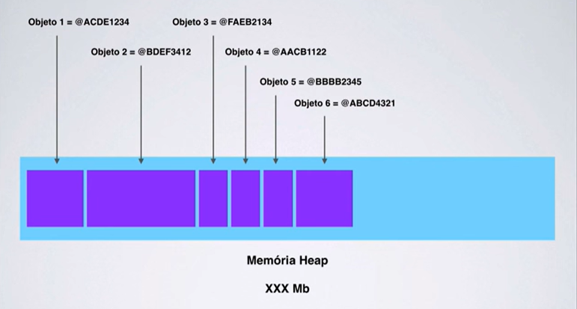

# Gerenciamento de Memória

É importamos aprendermos como o Java gerencia a memória do programa para entedermos o comportamento do código em determinadas situações. O Java gerencia a memória automaticamente e existe um _garbage collector_ que funciona no pano de fundo. Esse _garbage collector_ limpa objetos não utilizados e libera memória.

A memória costuma ser dividida em duas partes: **stack** e **heap**.

## Stack

  
Também conhecida como pilha, a _stack_ é responsável por armazenar os tipos primitivos e as referências para os objetos.  
Essa distinção é importante: nos tipos primitivos, é armazenado o valor. Já nos objetos, é armazenado a referência para o objeto. O objeto, na verdade, se encontra armazenado no _heap_.

Além disso, as variáveis que se encontram na pilha tem certa visibilidade, que é chamada de **escopo**. Quando o compilador executa o corpo de um método, ele pode apenas acessar objetos da pilha de memória daquela chamada. Ele não pode acessar outras variáveis, pois estão fora do escopo.

A pilha de memória é alocada por thread. Logo, toda vez que uma thread é criada e executada, ela tem sua prória pilha de memória e não pode acessar a pilha de memória das outras threads.

## Heap

Essa parte da memória é responsável por armazenar os objetos na memória. São referenciados pelas variáveis da pilha.

A palavra chave `new` assegura que tem espaço livre suficiente no _heap_, criando um objeto do tipo especificado na memória e criando a referência que vai para a pilha.

## Garbage Collector

O _garbage collector_(GC) varre a memória e limpa os objetos que não são mais referenciado pelo programa. Para isso, ele marca as referência que não estão sendo mais usadas e depois esses objetos são removidos da memória, liberando a utilização para a _JVM_. Após serem removidos, a memória é otimizada. O GC é chamado de tempos em tempos automaticamente.
