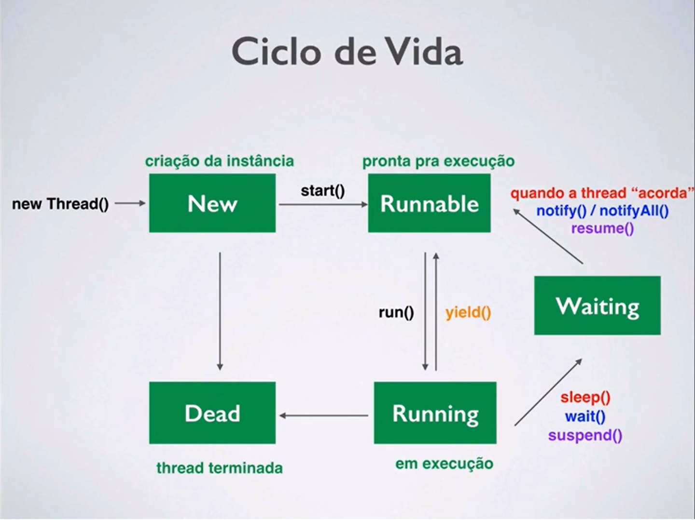
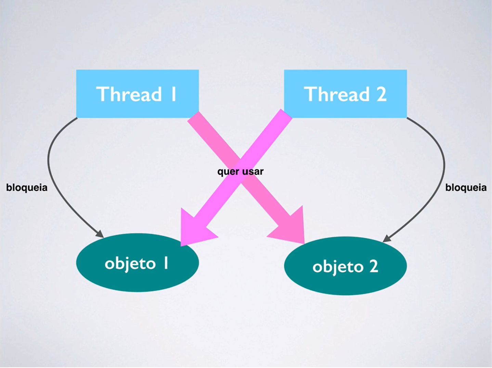

# Multitarefas: Processos e Threads

*Processo* é uma instância de um programa que está sendo executado.  
*Thread* é uma linha de execução dentro de um processo, sendo uma forma de um processo se autodividir em duas ou mais tarefas.  
Ao usar threads permitimos que um programa execute mais de uma tarefa ao mesmo tempo. Sendo assim, nos permite criar programas eficientes.

## Ciclo de Vida

Existem cinco estados importantes no ciclo de uma thread.
- Criação da instância (**New**)
  - `new Thread()`
  - Prontificar: `start()`
- Pronta pra execução (**Runnable**)
  - Executar: `run()`
- Em execução (**Running**)
  - Parar: `yield()`
  - Suspender: `sleep(), wait(), suspend()`
  - Terminar
- Suspensa (**Waiting**)
  - Acordar: `notify()/notifyAll(), resume()`
- Término (**Dead**)

## Criando uma Thread
- Extender a classe `Thread`
- Implementar interface `Runnable`

### Métodos Importantes
- `start`: inicia a thread, iniciando o método `run`
- `run`: executar a tarefa
- `sleep`: suspende a thread por `N` ms;

### Extendendo a classe `Thread`

```java
// Criando a Thread
public class MinhaThread extends Thread {
  private String nome;

  public MinhaThread(String nome) {
    this.nome = nome;
    // Ao chamar start no construtor, a Thread é executada automaticamente no momento de criação.
    start();
  }

  // Sobrescrevendo o método run. É necessário para executar a Thread.
  public void run() {
    try {
      for (int i = 0; i < 6; i++) {
        // Imprime o nome da thread e o contador
        System.out.println(nome + " " + i);
        // Suspende a thred por 0.5s
        Thread.sleep(500);
      }
    } catch (InterruptedException e) {
      e.printStackTrace();
    }
  }
}
```
Vamos criar uma classe Main para executarmos nossos testes.
```java
public class Main {
  public static void main(String[] args) {

    var thread = new MinhaThread("Thread #1");

  }
}
```

### Implementando a interface `Runnable`
Ao usar a interface `Runnable`, precisamos implementar o método `run`. Entretando, não tem como chamar o método start já que é uma interface que contem apenas a assinatura dos métodos.

```java
public class MeuRunnable implements Runnable {
  private String nome;
  private int tempo;

  public MeuRunnable(String nome, int tempo) {
    this.nome = nome;
    this.tempo = tempo;
    // Criamos a thread passando a Classe Meu Runnable como parametros
    Thread t = new Thread(this);
    // Inicializamos a thread
    t.start();
  }

  @Override
  public void run() {
    try {
      for (int i = 0; i < 6; i++) {
        System.out.println(nome + " " + i);
        if (i == 5) {
          System.out.println();
          System.out.println("Fim da " + nome);
          System.out.println();
        }
        Thread.sleep(tempo);
      }
    } catch (InterruptedException e) {
      e.printStackTrace();
    }
  }

}
```
### Melhores Abordagens

- Quando fazemos `extends` da `Thread`, o único método que precisa ser sobreposto é o `run`.
- Quando implementamos `Runnable`, também precisamos implementar o método `run`
- Com a classe implementando `Runnable`, podemos extender qualquer outra classe.

> :zap: Melhores Práticas:  
Se não for sobrepor qualquer outro método da classe `Thread`, pode ser melhor usar `Runnable`.

### Método `join`
Utilizamos o método `join` para esperarmos a finalização da thread antes de continuarmos a execução.
```java
  var runnable1 = new MeuRunnable("#1", 200);
  var runnable2 = new MeuRunnable("#2", 400);

  var thread1 = new Thread(runnable1);
  var thread2 = new Thread(runnable2);

  thread1.start();
  thread2.start();

  try {
    thread1.join();
    thread2.join();
  } catch (InterruptedException e) {
    e.printStackTrace();
  }

  // Só vai imprimir depois das 2 threads terminarem execução
  System.out.println("Finalizou");
```

## Definindo prioridades
Usamos o método `setPriority()` para definirmos a proridade da thread.  
```java
  var thread1 = new MeuRunnable("#1", 500);
  var thread2 = new MeuRunnable("#2",500);
  var thread3 = new MeuRunnable("#3",500);

  var t1 = new Thread(thread1);
  var t2 = new Thread(thread2);
  var t3 = new Thread(thread3);

// Definir prioridades
  t1.setPriority(Thread.MAX_PRIORITY);
  t2.setPriority(Thread.MIN_PRIORITY);
  t3.setPriority(Thread.NORM_PRIORITY);
```

## Sincronização
Sincronização é o ato de coordenar as atividades de 2 ou mais threads.
Quando 2 ou mais threads precisam acessar um recurso compartilhado, somente *uma* thread pode acessar o recurso por vez.
Para isso, precisamos usar a palavra chave `synchronized` para garantir o acesso único por vez.
```java
public synchronized int somaArray(int[] numeros) {
  soma = 0;

  for (int num : numeros) {
    soma += num;
    System.out.println("Executando asoma " + Thread.currentThread()getName() + " somando o valor " + num
        + " com o total de " + soma);

    try {
      Thread.sleep(200);
    } catch (InterruptedException e) {
      e.printStackTrace();
    }
  }

  return soma;
}
```
   
Imagina o seguinte cenário:
- Uma thread A está sendo executada dentro de um método sincronizado e precisa de acesso a um recurso R que no momento está indisponível
- Se a thread A ficar esperando por R, irá bloquear o objeto impedindo que outras thread acessem o mesmo
- Nesse caso a melhor solução para não causar o problema é liberar temporariamente o controle do objeto, permitindo que outra thread seja executada.

### métodos `wait, notify, notifyAll`  

- `wait`: bloqueia a execução da thread temporariamente, ou seja, coloca a thread em modo de espera.
- `notify`: notifica uma thread que estava esperando, ou seja, retoma a execução da thread.
- `notifyAll`: notifica todas as threads, e a que tem prioridade mais alta ganha acesso ao recurso.

### Suspensão

Pode ser útil suspender uma thread. Por exemplo, uma thread que mostra a hora do dia. Podemos suspender e posteriormente resumir a execução.
Até o Java 2 existiam os métodos `suspend, resume e stop`. O método `suspend` foi substituido por poder causar *deadlock*. Logo o resume foi removido, por não funcionar sem o suspend. O método stop foi substituído pelo método `interrupt`. Entretanto, é possível adicionar esses comportamentos de maneira mais segura na thread.
- `suspend`: suspende temporariamente a execução da thread
- `resume`: resume a execução da thread
- `stop`: termina a execução da thread

## Deadlock
O deadlock ocorre quando uma thread 1 quer acessar um recurso 2 que está bloqueado pela thread 2. E a thread 2 quer acessar um recurso 1 que está bloqueado pela thread 1. Quando isso acontece o programa não consegue prosseguir.  

  
Um exemplo de deadlock no código:
 ```java
 public static void main(String[] args) {
    final String RECURSO_1 = "Recurso #1";
    final String RECURSO_2 = "Recurso #2";
    
    var t1 = new Thread(() -> {
      synchronized (RECURSO_1) {
        System.out.println("T #1: block recurso 1");

        try {
          Thread.sleep(200);
        } catch (InterruptedException e) {
          e.printStackTrace();
        }

        System.out.println("T #1: access recurso 2");

        synchronized (RECURSO_2) {
          System.out.println("T #1: block recurso 2");
        }
      }
    });

    var t2 = new Thread(() -> {
      synchronized (RECURSO_2) {
        System.out.println("T #2: block recurso 2");

        try {
          Thread.sleep(200);
        } catch (InterruptedException e) {
          e.printStackTrace();
        }

        System.out.println("T #2: access recurso 1");

        synchronized (RECURSO_1) {
          System.out.println("T #2: block recurso 1");
        }
      }
    });

    t1.start();
    t2.start();
  }
 
 ```