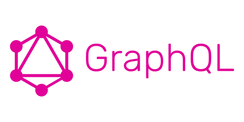

# GraphQL - O que é GraphQL?



## História
Em 2012, o Facebook iniciou esse projeto para superar problemas de busca de dados na sua plataforma mobile nativa. Isso mudou o foco de desenvolvimento para os aplicativos *client*. Em 2015, GraphQL virou open source e um grande envolvimento da comunidade se consolidou.

## A motivo do GraphQL
GraphQL veio a existência devido a necessidade de melhor flexibilidade e eficiência nas interações cliente-servidor.

## O que é GraphQL?
GraphQL é essencialmente uma linguagem de consulta para sua API. É somente uma especificação e não é uma biblioteca, produto nem uma base de dados.
É uma alternativa mais flexível eficiente do que o REST.

## API Rest
Usando o REST, nos comunicamos com um *endpoint* fazendo uma requisição. E como resposta, recebemos um JSON massivo.

## API GraphQL
GraphQL permite escrevermos uma query com os resultados que desejamos e recebemos um JSON somente com os campos e filtros escolhidos.

GraphQL Query   
```graphql
{
  allPeople(last: 3) {
    people {
      name
      gender
    }
  }
}

```

Resposta JSON
```json
{
  "data": {
    "allPeople": {
      "people": [
        {
          "name": "João",
          "gender": "male"
        },
        {
          "name": "Nathan",
          "gender": "male"
        },
        {
          "name": "Lívia",
          "gender": "female"
        }      
      ]
    }
  }
}
```

### Benefícios
- O *client* tem o poder de pedir exatamente o que é necessário e nada mais
- Agnóstico em relação a linguagem de programação
- A API GraphQL permite a busca de todos os dados necessário numa só requisição

## Quem está usando?
Tantos times pequenos como grandes estão usando GraphQL no lugar de APIs REST.
Alguns grandes utilizadores:  
- Facebook
- PayPal
- Twitter
- Yelp
- GitHub
> Lista completa pode ser acessada [aqui](https://graphql.org/users/).

## REST vs GraphQL
Imagina